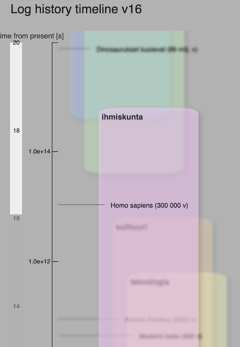
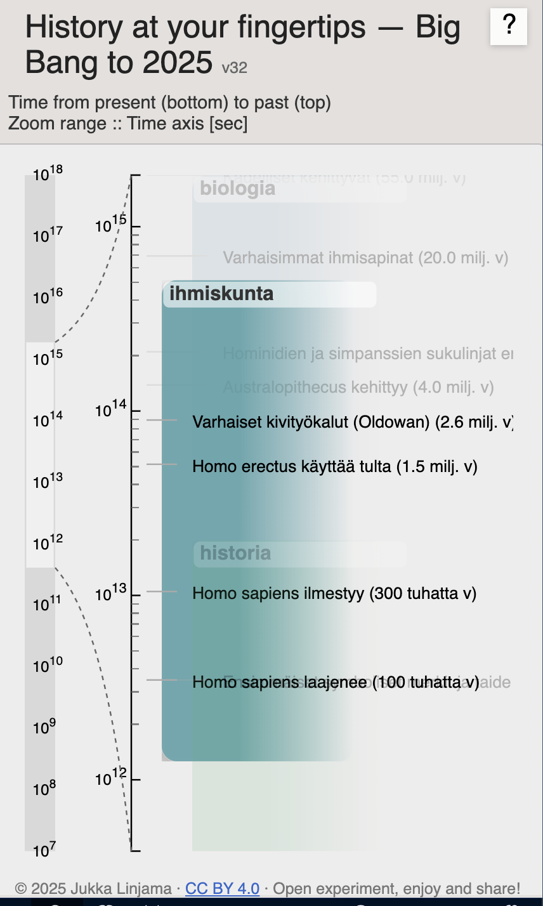

# Logaritminen aikajana

Interaktiivinen visualisointi, joka näyttää historian ja kosmoksen tapahtumat logaritmisella aikajanalla.

## Yleiskuva

Projektin tavoitteena on antaa hahmotus äärimmäisen pitkistä ja lyhyistä aikaskaaloista yhdellä näkymällä. Aikajana ulottuu **Alkuräjähdyksestä (13,8 mrd vuotta sitten) nykypäivään (2025)**.  

Visualisointi on pystysuuntainen, ja aikaskaala on **log₁₀(Δt)** – jokainen dekadi (10ⁿ) vie yhtä paljon tilaa näytöllä.  
Tapahtumat on ryhmitelty osittain päällekkäisiin teemoihin (esim. kosmos, biologia, ihmiskunta, historia, teknologia).  

Projektin tavoitteena on myös mahdollistaa, että **kuka tahansa voi kokeilla omia teemojaan ja tapahtumiaan** ja nähdä ne visualisoituna aikajanalla. Tätä varten kehitetään erillistä **editoria**, jolla voi muokata ja tallentaa `eventsDB.json`-tiedostoa.

## Ominaisuuksia

- **Zoomattava ja vieritettävä aikajana** (hiiren rulla, pinch/drag mobiilissa).
- **Teemakortit**: jokainen teema näkyy omana värillisenä korttinaan.
- **Klikkausaktivointi**: kortin voi tuoda etualalle.
- **Hover / tap kommentit**: tapahtumista avautuu lisätietoja.
- **Zoom bar** oikeassa reunassa näyttää mittakaavan ja zoomausalueen.
- **Mobiilituki**: skaalautuu myös puhelimille ja tableteille.

## Tekninen rakenne

Nykyinen versio (v33+) koostuu useista tiedostoista:

- `index.html` – sivun perusrakenne
- `style.css` – ulkoasut, värit, typografia
- `timeline.js` – D3.js-koodi: akselit, zoom, kortit, tapahtumat
- `eventsDB.json` – tietokanta tapahtumille (ryhmitelty teemoittain)

## Versiohistoria

- **v1–v22** (Git repo: log-aikajana)  
  - Toteutus yhtenä isona HTML-tiedostona (~1000 riviä).
<figure style="margin:16px auto; text-align:center;">
  
  <figcaption style="font-size:90%; color:#666; margin-top:6px;">
    Kokeilu teemakorttien häivytyksellä (v16), joka ei toiminut mobiilissa :()
  </figcaption>
</figure>

  - Aikajana taulukkomuodossa, aluksi kaksi näkymää: kosminen ja historiallinen.  
  - Katso alkuperäinen README: [log-aikajana v22](https://github.com/JukkaTLinjama/log-aikajana/blob/main/README.md).

- **v23–v32**  
  - D3.js otettiin mukaan.  
  - Ensimmäiset kortit ja zoomaus.  
  - Kokeiluja eri asettelulla ja tyyleillä.  
  - **Demo**: [v32 GitHub Pages -- log-aikajana](https://jukkatlinjama.github.io/log-aikajana/)
  

- **v33 -- uusi repo: log-aikajana-v33**  
  - Iso rakenteellinen muutos: projekti jaettiin tiedostoihin (`index.html`, `style.css`, `timeline.js`, `eventsDB.json`).  
  - Zoom bar lisättiin oikeaan reunaan.  
  - Info-paneeli ja interaktiiviset kommentit.

- **v34–v38**  
  - Kerrosjärjestyksen hallinta: kortit, akselit, zoom bar eivät peitä toisiaan.  
  - Typografian ja värien hienosäätö.  
  - Mobiilioptimointeja (fonttikoot, hitboxit).  
  - Automaattinen fokusointi **ihmiskunta**-korttiin zoom-animaatiolla.
    

## EventsDB ja editori

Projektin data on eriytetty tiedostoon **`eventsDB.json`**, joka sisältää kaikki aikajanan tapahtumat.  

### Rakenne

<pre style="font-size:10px; line-height:1.3; background:#889; color:#ddd; padding:6px 8px; border-radius:4px;">
{
  "metadata": { "version": "1.x", "author": "JL", "updated": "YYYYMMDD" },
  "events": [
    {
      "theme": "teema",
      "events": [
        {
          "label": "Tapahtuman nimi",
          "year": "teksti",
          "time_years": 123456,
          "log": 12.34,
          "author": "",
          "ref": "",
          "comments": "lisätietoa"
        }
      ]
    }
  ]
}
</pre>

- **theme**: ryhmä (esim. *kosmos*, *biologia*, *ihmiskunta*, *historia*, *moderni teknologia*).  
- **label**: tapahtuman nimi.  
- **year**: ihmisen luettava muoto (esim. “3.8 mrd v”).  
- **time_years**: numeerinen arvo vuosina.  
- **log**: log₁₀(Δt) nopeampaa renderöintiä varten.  
- **author/ref/comments**: lisätietokenttiä lähteille ja huomioille.  

### Editorin kehitys

Projektin rinnalla on kokeiltu **editoria**, jonka avulla tapahtumia voi lisätä ja muokata ilman manuaalista JSON-käsittelyä.  
- Käyttöliittymä kenttien (label, year, theme, kommentit) muokkaamiseen.  
- Teemoittainen ryhmittely.  
- Mahdollisuus tallentaa muutokset takaisin `eventsDB.json`:iin.  

Editorin kehitys on erillinen kokeiluversio, mutta sen tarkoitus on helpottaa datan laajentamista tulevaisuudessa ja vähentää käsin tehtäviä virheitä.

Alla esimerkki editorista, jolla voi muokata ja tallentaa `eventsDB.json`-tiedostoa:

<figure style="margin:16px auto; text-align:center;">
  
  <figcaption style="font-size:90%; color:#666; margin-top:6px;">
    EventsDB-editorin esikatselu
  </figcaption>
</figure>

## Lisenssi

© 2025 Jukka Linjama  
Julkaistu [Creative Commons BY 4.0](https://creativecommons.org/licenses/by/4.0/) -lisenssillä.  
Saat vapaasti käyttää, muokata ja jakaa, kunhan mainitset alkuperäisen tekijän.  

---

- **Uusin versio**: [v38 GitHub Pages](https://jukkatlinjama.github.io/log-aikajana-v33/)

📄 Katso myös [CHANGELOG.md](./CHANGELOG.md) tarkempiin versiotietoihin.  
